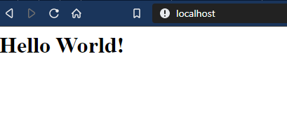

# What are containers and how do they differ from other technologies?

### "Official"

Docker is an open platform for developing, shipping, and running applications. Docker enables you to separate your applications from your infrastructure so you can deliver software quickly. With Docker, you can manage your infrastructure in the same ways you manage your applications. By taking advantage of Docker’s methodologies for shipping, testing, and deploying code quickly, you can significantly reduce the delay between writing code and running it in production. [read more.](https://docs.docker.com/engine/docker-overview/)

### "Unofficial"

An way of binding a kernel process to a filesystem and load only the infrastructure configuration that is required. 
Containers are light-weight as there is not overhead of the entire operating system.

``Containers vs virtual machines.``

The biggest difference is with Virtual machines you have the entire Operating system where as with containers you have only the kernel.


# Docker Desktop

Docker desktop is a application that can be used by developers to test and run images and containers, this application comes in two variants:

- Docker Desktop Community
- Docker Desktop EE

Community edition is free where as Docker Desktop EE is licenced software and requires a quotation to recieve a lisence key.

To install docker desktop [from](https://www.docker.com/products/docker-desktop), sign up and download and install the version for your operation system. 

Once installed you will have a whale icon in the respective system tray:


Right clicking on the icon give a menu item that allows you to alter the settings for the application.


`Enable experimental features by selecting the Settings -> Daemon and enable experimental features.`


In this folder [workshop/docker-101] you will find:

- index.html
- Dockerfile
- .dockerignore

## File explanation

``Dockerfile`` this is the instruction file that is used to create a image, it has a list of instructions that is passed to the Docker cli when performing the: ``docker build`` command. 

``index.html`` is the custom webpage that will be used to show that the image created has the changes by running the container.

``.dockerignore`` this is a file that is used to ignore files from the Docker runtime when building to improve performance.

## Some Definitions

``Docker Image``: This is a predefined contact of what is required for your application to be run.

``Docker Container``: This is the running application that was based from a Docker image.


## Breakdown of the basic commands

    [application] [action] [options] [image] [program in the container]

``Example of this``

    [docker] [run] [--name] (my-app) [mcr.microsoft.com/dotnet/framework/sdk] (pwsh -c "Write-Host 'Hello World' ")


Switching between Linux and Windows is done by right clicking on the whale icon in your system tray and selecting the ``Switch to Windows containers`` or ``Switch to Linux containers`` options in the menu.

## Intention 

Run our first container.

Open powershell run the following:

    docker run --name mywebserver -d -p 80:80 nginx

Open your browser and you will see the default IIS page when navigating to http://localhost.


### Breakdown

``--name`` was passed to give the container a name so that it is easier to identify. ``-d`` passes the flag to the runtime to detach your console from the console in the container. ``-p`` performs a port binding from the host ``on the left`` to the container ``on the right``.


``NOTE:`` 

## Lab 2

Ensure that your Docker context is running in the Linux containers mode.

## Intention 

Inspect a container to get some information from it.

### Logs

    docker logs mywebserver


As shown above you can see the log messages from nginx terminal in the container.

This will pass to the terminal the console output from the container.

### Inspect properties

If it required to check variables like environment variables, file system properties etc.

    docker inspect mywebserver


### See whats running

To have a list of running containers you can run:

    docker ps


or:

    docker container ls


or:

    docker ps -a -f status=running


### --format 

Next lets get the IPAddress of the container, for that we use the -f / --format flag to extract metadata of the container.

Run in a elevated PowerShell terminal:

    docker inspect -f "{{ .NetworkSettings.Networks.bridge.IPAddress }}" mywebserver


### Intention

The purpose of this lab is to demonstrate that it is possible to interact with a container that is created.


    docker container cp .\index.html mywebserver:/usr/share/nginx/html




``NOTE:``

The command above needs to be run the folder [workshop/docker-101] as the .\index.html indicates from ``[current directory]\index.html``. 

The custom index file has been copied to the container.


### Building Images

The purpose of this lab is to demonstrate the build command which is commonly used to create application image for consuming in a production environment.

This can be achieved by using a Dockerfile. In the docker-101 folder run the following command:

    docker build -t my-awesome-app .


### Breakdown

``docker`` targeting the Docker cli to invoke methods exposed.

``build`` the compile command in the Docker cli to create image repositories.

``-t`` this flag is used to give your image repository a logical name, in this example the image repository name my-awesome-app is given with no tag so the cli will append ``latest``.

    It is best practice to version your image repositories. 

Example ``my-awesome-app:1``.

``.`` , this is the build context where the cli will begin looking for files, in this example it is the current directory.

### Dockerfile

The Dockerfile is a list of instructions that get execuited by the docker cli, a container gets created for each line and moves context between conataines while the ```RUN``` command executes what is mentioned.

NOTE: Best practice is to combine logical commands together to minimise the containers ```layers``` making the total image size smaller.

### FROM

This line specifies a base image that will be used as the starting point.

    FROM nginx

### RUN

This a method of executing a command or script.

    RUN apt-get install nodejs

### COPY

Add files to the container that can be used for building or retaining as a artifact in the image.

    COPY index.html /usr/share/nginx/html/index.html

### EXPOSE

Expose a port when the container is run, this can be overridden.

## Run The Image

Next the image needs to be run, simply run the command:

    docker run -d -p 81:80 my-awesome-app

Navigate to in your browser ``http://localhost:81`` and you will see the custom page.


# Docker licensing model

- Community
    - Docker Desktop [Mac, Windows]
    - Docker Engine [Fedora, Ubuntu, Centos]
- Enterprise
    - Docker Desktop [Windows]
    - Docker Engine [Windows, RedHat]

# New features and some advanced concepts

### Docker Assemble (experimental)

Docker Assemble (docker assemble) is a plugin which provides a language and framework-aware tool that enables users to build an application into an optimized Docker container. With Docker Assemble, users can quickly build Docker images without providing configuration information (like Dockerfile) by auto-detecting the required information from existing framework configuration.

Docker Assemble supports the following application frameworks:

- Spring Boot when using the Maven build system
- ASP.NET Core (with C# and F#)

[read more](https://www.docker.com/products/developer-tools)

### Working with Contexts

A single Docker CLI can have multiple contexts. Each context contains all of the endpoint and security information required to manage a different cluster or node. The docker context command makes it easy to configure these contexts and switch between them.

As an example, a single Docker client on your company laptop might be configured with two contexts; dev-k8s and prod-swarm. dev-k8s contains the endpoint data and security credentials to configure and manage a Kubernetes cluster in a development environment. prod-swarm contains everything required to manage a Swarm cluster in a production environment. Once these contexts are configured, you can use the top-level docker context use <context-name> to easily switch between them.

[read more](https://docs.docker.com/engine/context/working-with-contexts/)

# Overview

In this section we were introduced to the Docker cli and ran a nginx container, changed the loading page, and built a custom image that can be run later on a different machine.

# Maintenance of a system running the Docker engine

It would be good to clean up containers that are not required, to clean up it is possible to run:

    docker rm $(docker ps --format="{{.ID}}") -f


    docker rmi $(docker images my-awesome-app --format="{{.ID}}") -f


