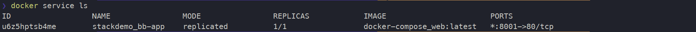
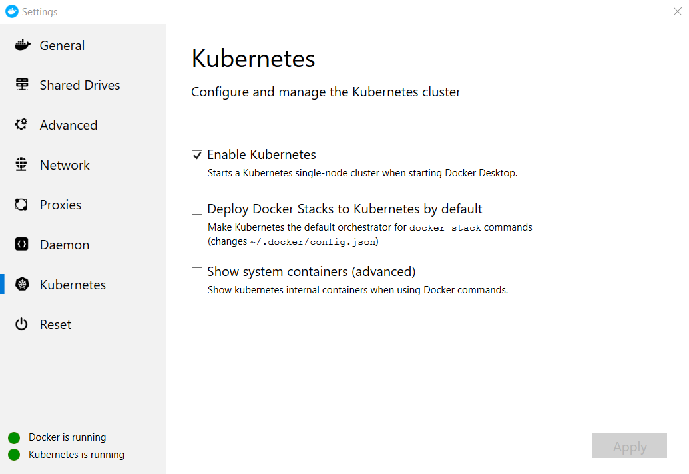

# BuildKit and how to author the Dockerfile


# Docker-Compose

Compose is a tool for defining and running multi-container Docker applications. 
With Compose, you use a YAML file to configure your application’s services. 
Then, with a single command, you create and start all the services from your configuration.

Compose works in all environments: production, staging, development, testing, as well as CI workflows. You can learn more about each case in Common Use Cases.

Using Compose is basically a three-step process:

1. Define your app’s environment with a Dockerfile so it can be reproduced anywhere.

2. Define the services that make up your app in docker-compose.yml so they can be run together in an isolated environment.

3. Run docker-compose up and Compose starts and runs your entire app.

A docker-compose.yml looks like this:

    version: '3'
    services:
    web:
        build: .
        ports:
        - "5000:5000"
        volumes:
        - .:/code
        - logvolume01:/var/log
        links:
        - redis
    redis:
        image: redis
    volumes:
    logvolume01: {}

For more information about the Compose file, see the [Compose file reference](https://docs.docker.com/compose/compose-file/).

Compose has commands for managing the whole lifecycle of your application:

- Start, stop, and rebuild services
- View the status of running services
- Stream the log output of running services
- Run a one-off command on a service

## Automated testing environments

An important part of any Continuous Deployment or Continuous Integration process is the automated test suite. Automated end-to-end testing requires an environment in which to run tests. Compose provides a convenient way to create and destroy isolated testing environments for your test suite. By defining the full environment in a Compose file, you can create and destroy these environments in just a few commands:

    docker-compose up -d
    ./run_tests
    docker-compose down

```Working in the folder: [checkout location]/workshop/kubernetes-101```

When you need to run the containers again you can run:

    docker-compose build

At times code is altered and you would like to rebuild but based on a configuration then it is
possible to do this by passing a argument to the dockerfile from the docker-compose build action.

Example:

    docker-compose build --build-arg config=debug

To run the containers as a service run:

    docker-compose up -d

``-d`` releases the terminal from the container terminal allowing it to run in the background.

To run two of the three services run:

    docker-compose up --force-recreate db web

In the above example the api can be run in ``debug`` and the rest of the application stack 'db' & 'web' are run allowing a developer experience to view the potencial issue or add features.

    docker-compose build --build-arg config=production
    docker-compose up  --force-recreate
    docker-compose up -d

To remove the services simple run in the same folder where the docker-compose file is, 

    docker-compose down


# Basics in orchestration

# Docker Swarm with compose 

## What is a swarm?
The cluster management and orchestration features embedded in the Docker Engine are built using swarmkit. Swarmkit is a separate project which implements Docker’s orchestration layer and is used directly within Docker.

A swarm consists of multiple Docker hosts which run in swarm mode and act as managers (to manage membership and delegation) and workers (which run swarm services). A given Docker host can be a manager, a worker, or perform both roles. When you create a service, you define its optimal state (number of replicas, network and storage resources available to it, ports the service exposes to the outside world, and more). Docker works to maintain that desired state. For instance, if a worker node becomes unavailable, Docker schedules that node’s tasks on other nodes. A task is a running container which is part of a swarm service and managed by a swarm manager, as opposed to a standalone container.

[read more.](https://docs.docker.com/engine/swarm/key-concepts/)

``NOTE:`` ```Working in the folder: [checkout location]/workshop/kubernetes-101/swarm```

In this example with will use a docker-compose.yml file to simply run a one replica container 

    docker stack deploy --compose-file docker-compose.yml stackdemo

To view the services run:

    docker service ls




Open browser and navigate to http://localhost:8001 and you should see the UI that we created earlier.

For more information on replicas [read compose-file/#replicas](https://docs.docker.com/compose/compose-file/#replicas) from the official documentation.

Swarm is a nice way of getting familiar with orchestration and how to limit and control container workloads.


# Docker Kubernetes with compose

Enable the Kubernetes by right clicking on the docker icon, select settings then Kubernetes.



    - What is swarm and when to use it
    - Docker-Compose with swam
    - What is Kubernetes
    - Swarm vs Kubernetes
- Docker Desktop and Kubernetes
    - Kubernetes Tools
 -Pipelines with containers
- When should you put your build in a container
    - How to put your build into a container
    - Benefits of containerized builds

Docker Desktop includes a standalone Kubernetes server and client, as well as Docker CLI integration. The Kubernetes server runs locally within your Docker instance, is not configurable, and is a single-node cluster.

The Kubernetes server runs within a Docker container on your local system, and is only for local testing. When Kubernetes support is enabled, you can deploy your workloads, in parallel, on Kubernetes, Swarm, and as standalone containers. Enabling or disabling the Kubernetes server does not affect your other workloads.

With Docker desktop you can run native Kubernetes commands like:

    kubectl get nodes

[read more.](https://docs.docker.com/docker-for-windows/kubernetes/)
